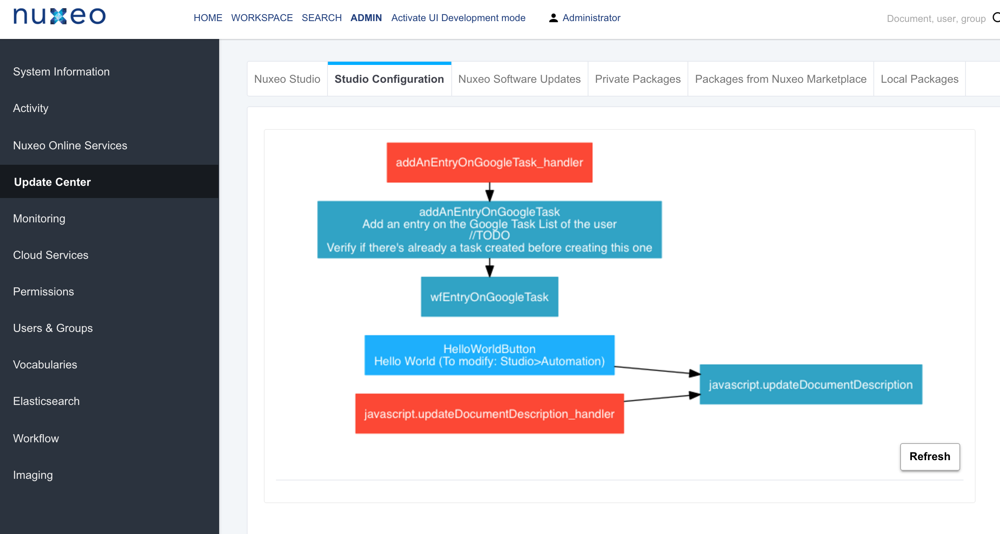

# qualitified-studioviz

This plug-in enables the visualization of the studio configuration based on graphviz.

## List of Items Displayed
There are 2 types of graphs:
- The Data Model: Document Types, Schemas and Facets
- The Business Rules showing the relations between User Actions, Automation Chains/Scriptings and Event Handlers

## GraphViz
You need to install GraphViz (http://www.graphviz.org/Download.php) in order to generate the graphics.
- For MacOs: http://www.graphviz.org/Download_macos.php (If you have `brew` installed, you can also `brew install graphviz`
- For Linux: `sudo apt-get install graphviz`
- For Windows: http://www.graphviz.org/Download_windows.php

## Build

Assuming `maven` is correctly setup on your computer go under the qualitified-studioviz folder and run:

```
mvn clean install
```

TheNuxeo Package is at qualitified-studioviz-mp/target/qualitified-studioviz-mp-1.0-SNAPSHOT.zip and can be installed on your Nuxeo Server.

## nuxeo.conf
Set the variable `studio.artifact.id=Your_Studio_Project_ArtifactID`

# About Qualitified

At Qualitified we provide packages on top of nuxeo, in order to bring additional behaviors to the platform. We also do consultings on nuxeo projects by bringing our expertise on multiple levels (Data Models, Business Rules, Workflows, UI based on Polymer etc.)
More information at www.qualitified.com
